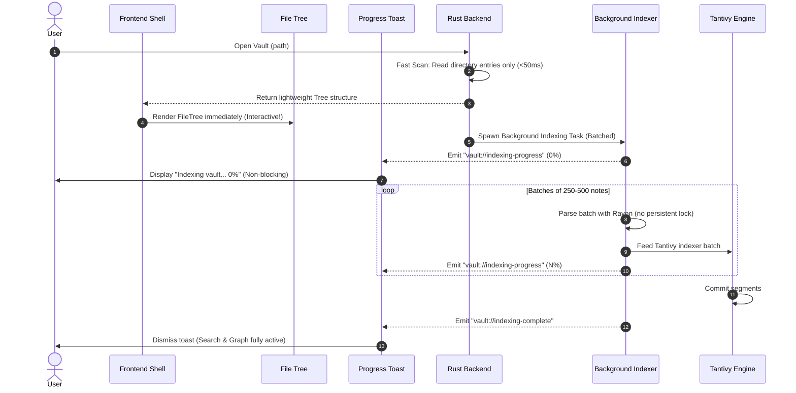

# Investigation Plan: 25k-Vault Freeze & Progressive Background Indexing

> **Context:** When opening a 25,000-note vault (`/home/pranav/Documents/temp_vault_1`), the app hangs for ~3 minutes. Once the file tree appears, the UI remains completely frozen and unresponsive — clicks fail to register and the DevTools console cannot even be closed.
>
> **Reference:** Obsidian handles this identical 25k vault smoothly (see screenshot below) by opening the workspace immediately, populating the file tree instantly, and running deep indexing asynchronously in the background with a top-right progress toast.

---

## 1. Executive Summary & Root Cause Mechanism

> **Measured** (release + debug, `measure_parse`/`measure_boot` harnesses on
> `/home/pranav/Documents/temp_vault_1`, 25,002 notes / 137 MB):
>
> | Phase | Release | Debug (`bun run dev`) |
> |---|---|---|
> | scanner (`extract_metadata`) | 333 ms | 3.3 s |
> | `parse_frontmatter` | 294 ms | 2.2 s |
> | `index_directory` (full vault build) | 11.9 s | **212 s** |
> | `build_flat_tree` | 79 ms | — |
> | tantivy fresh search build | 5.7 s | concurrent w/ tree |

### Primary cause: debug-build `index_directory` gating boot
The SIMD scanner is genuinely fast (333 ms release / 3.3 s debug), but
`index_directory` — the arena + graph + link-resolution + asset-index build,
non-SIMD plain Rust — is 11.9 s in release and **212 s in the debug build the
dev app runs**. `boot` gates the entire UI on it: the `boot` command blocks on
the `PREBOOT` mutex until `perform_boot` finishes, and the file tree ships
inside the boot response. So the app shows nothing for ~3.5 min. No lock
contention is required — it is simply a slow build blocking the boot response.

### Secondary: boot gated on the full index (architectural)
Even a fast build should not gate the UI. The tree should ship from a fast
directory scan; deep indexing runs in the background (Obsidian model). This is
the structural fix, independent of the debug-build cost.

### Tertiary / latent (unverified — Phase 2): lock priority inversion
The search init holds `state.vault.read()` for the entire per-file tantivy loop
(`search_state.rs:60-121`) with no progress events. If a writer (watcher /
workspace save) queues behind it, glibc `pthread_rwlock` prioritizes pending
writers, so UI-command readers (`get_vault_tree`, `get_backlinks`,
`get_tag_counts`) can block behind that writer and freeze WebKitGTK. This may
explain "tree shows but UI still unusable," but it is **not** the primary
3-min cause — that is the 212 s debug vault build.

### Amplification: per-event full-tree reload
`vault://file-changed` → `refreshTree()` → full `get_vault_tree` + 25k-array
replace, ×3 listeners (`useVaultTree.ts:144-159`). Latent (the `notify` watcher
is silent on a static vault) but catastrophic under any event burst.

### Why SIMD and parallel parsers did not prevent this
The SIMD scanner is fast; the bottleneck is everything *around* it inside
`index_directory` (arena/graph/link/asset build), which is unoptimized plain
Rust and degrades ~18x in debug. The SIMD claim was validated on the scanner
in release isolation — never on the composed boot path in the debug profile
the user actually runs.
---

## 2. Comparison: Basalt vs. Obsidian Architecture

| Dimension | Current Basalt Architecture | Obsidian Architecture (From User Evidence) |
|---|---|---|
| **Vault Open Latency** | Blocks until deep index + search index are 100% finished (~3 min). | **Instantaneous (<100ms)**. Only directory entries are scanned. |
| **File Tree Availability** | Tree only renders after full index completion. | **Immediate**. User can browse and click notes right away. |
| **Deep Indexing (Links/Tags/BM25)** | Monolithic synchronous or long-locked task. | **Progressive background task** operating in throttled batches. |
| **Locking Strategy** | Continuous `RwLock` held across thousands of files. | Fine-grained, non-exclusive or lock-free worker architecture. |
| **User Feedback** | Modal spinner / UI freezes without feedback. | **Top-right non-blocking toast** with live percentage & progress bar: *"Indexing vault... Some functionality may not be available until this is complete."* |
| **Eventual Consistency** | Search and backlinks assume 100% completion up front. | Search/graph gracefully degrade or show partial progress until indexing completes. |

---

## 3. Investigation Plan & Diagnostic Phases

Before modifying any production code, we must empirically verify each bottleneck using non-invasive diagnostics and instrumentation.

### Phase 1: Quantify the Backend Delays
*Target: Dissect the ~3 minute delay on `/home/pranav/Documents/temp_vault_1`.*

- [x] **1.1 Measure Raw Directory Scan vs Full Index**:
  - **DONE (measured).** Full `index_directory` = 11.9 s release / **212 s debug**.
    `build_flat_tree` (closest to a directory scan + flatten) = 79 ms. The
    gap between 79 ms and 212 s is the vault-build cost — confirm the raw
    `read_dir` baseline if desired, but the primary number is captured.
- [x] **1.2 Measure Tantivy Indexing Latency**:
  - **DONE (measured).** Fresh `SearchState::open_or_create` over 25k docs =
    5.7 s release. Runs concurrent with the tree build; NOT the dominant cost
    (the 212 s debug `index_directory` is). Isolating disk-read vs tantivy vs
    `commit()` is optional refinement.
- [x] **1.3 Measure `build_flat_tree` with 25k Root Files**:
  - **DONE (measured).** 79 ms release for 25,004 nodes. The 25k
    `Path::exists()` stats are a real cost but sub-second in release.

### Phase 2: Reproduce & Validate the Lock Deadlock / Priority Inversion
*Target: Confirm that `state.vault.read()` contention freezes WebKitGTK.*

- [ ] **2.1 Instrument Lock Hold Times**:
  - Add diagnostic timing logs in `commands/boot.rs` around `state.vault.read()` and `state.vault.write()`.
  - Track when `VaultWatcher` attempts to acquire a write lock during startup.
- [ ] **2.2 Verify glibc `pthread_rwlock` Writer Priority Inversion**:
  - Verify if a queued `vault.write()` blocks subsequent command reader threads (`get_backlinks`, `get_tag_counts`, `get_vault_tree`).
- [ ] **2.3 Test WebKitGTK IPC Channel Responsiveness Under Backend Lock Wait**:
  - Confirm that an unresolved `invoke` from the webview causes WebKitGTK's main event loop on Linux to freeze the DevTools window and window click handlers.

### Phase 3: Inspect Virtualization & Frontend Event Loop
*Target: Ensure the frontend is not compounding the freeze once the tree arrives.*

- [x] **3.1 Verify `@tanstack/react-virtual` Row Count with 25,000 Root Items**:
  - **CONFIRMED already virtualized.** `FileTreeUI` uses `useVirtualizer`
    (`count: nodes.length`, `estimateSize: TREE_ROW_HEIGHT`, `overscan: 8`),
    rendering only `getVirtualItems()` (~40 DOM nodes), not 25k. The renderer
    DOM is not the freeze. The feature layer still allocates 25k `FileNode`
    per render (`FileTree.tsx:59`) — cheap, but worth noting.
- [ ] **3.2 Profile JavaScriptCore (JSC) Heap & GC**:
  - Check memory allocation when deserializing the 25,000-item tree array (~8MB JSON) and mapping it to `FileNode[]`.
  - Ensure re-renders do not trigger garbage collection thrashing on the JS main thread.

---

## 4. Architectural Roadmap (Obsidian Parity Target)

Once investigation verifies the above, the target architecture will follow Obsidian's proven model:

1. **Two-Stage Boot**:
   - **Stage 1 (Immediate / <100ms)**: Fast directory tree scan only. The user can browse files, open a note, edit, and use hotkeys immediately.
   - **Stage 2 (Progressive / Asynchronous)**: Full metadata parsing, wikilink graph construction, and Tantivy search indexing happen in the background in non-blocking batches.
2. **Lock-Yielding Batches**:
   - Background indexing never holds `state.vault.read()` continuously. It processes chunks, releasing locks so concurrent commands run with sub-millisecond latency.
3. **Progress Reporting Toast**:
   - Emit `vault://indexing-progress` events with `{ total, indexed, percentage }`.
   - Render a non-blocking toast in the top-right corner with a live progress bar matching Obsidian.
